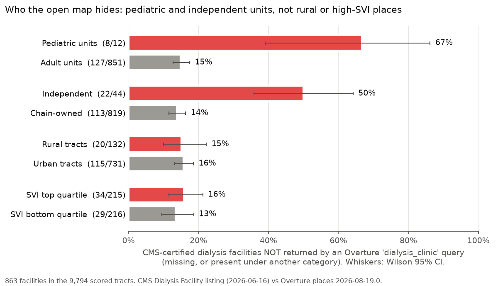
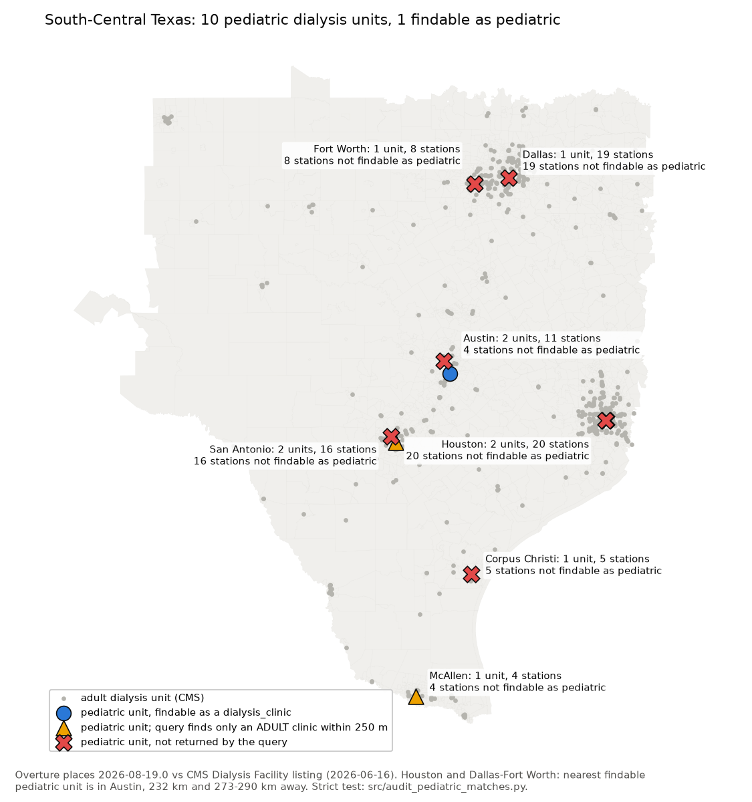

# Best Bias Discovery: Children on dialysis are invisible on the open map (CMS vs Overture, 863 facilities)

---

**Zindi user:** Teddythebotbuilder · **Submission ID:** Q3WQ174d · **Code and data:** https://github.com/teddywasserman/overture-coverage-equity
**Overture release:** 2026-08-19.0 (challenge bundle) · **External data retrieved:** 2026-10-02

## Best Bias Discovery

### TL;DR

We checked every Medicare-certified dialysis facility inside the 9,794 scored tracts (863 facilities) against Overture places.

* **Pediatric units are missing from an Overture `dialysis_clinic` category query 4.5 times as often as adult units.** For 8 of 12 pediatric units (67%) the query does not return the unit. For adult units the figure is 127 of 851 (15%). Odds ratio 11.4, Fisher exact p = 8.4 × 10⁻⁵.
* **A stricter test finds only 1 of 12 pediatric units listed as a pediatric dialysis clinic:** Children's Dialysis Clinic of Central Texas, in Austin. The other three "findable" units only look findable because an *adult* clinic sits within 250 m.
* **Families in Houston and Dallas–Fort Worth cannot find any pediatric unit locally.** In both metros, every pediatric unit is invisible to the category query. The nearest pediatric unit the query returns is in Austin: about **232 km** from Houston and **273–290 km** from Dallas–Fort Worth. Meanwhile the query returns adult clinics about 1 km away, and those clinics generally cannot treat young children.
* **The disparity follows facility type and ownership, not geography or demographics.** Independent units are hidden 50% of the time and chain units 14% (OR 6.3, p = 4 × 10⁻⁸). Rural/urban, SVI and tribal contrasts are all null. The automated scorecard stratifies only by geography and demographics, so it cannot see this pattern.

### 1. The pattern, and why the scorecard misses it

Hemodialysis is a life-sustaining treatment on a fixed schedule, typically three sessions a week. In a hurricane, freeze, heat wave or power shut-off, patients and relief teams must find the nearest *operating* unit, and more and more of them do it with map-based tools. Those tools (routing apps, relief dashboards, LLM agents, emergency GIS layers) build "nearest facility" layers from open POI data by category.

We asked a simple question: **if you query Overture for `dialysis_clinic`, which certified dialysis units do you get back?**

The challenge's automated scorecard cannot answer this, for three reasons:

* The POI gap scores only fire stations, EMS and schools, plus a CBP establishment total. Dialysis is never scored.
* The CBP half counts *all* places. A pediatric dialysis unit filed as `hospital` therefore still counts as coverage.
* The five scorecard metrics stratify by geography and population: urban/rural, SVI, CVI, tribal, and hazard. The disparity we found runs along **patient age and facility ownership**, which lie outside that grid. On every predefined stratum it is null (table in §2.3). A geography-only audit would conclude that dialysis coverage is equitable.

### 2. Evidence

#### 2.1 Method (reproducible: `bash run_all.sh discovery` in https://github.com/teddywasserman/overture-coverage-equity)

1. **Facilities.** We used the CMS *Dialysis Facility – Listing by Facility* (dataset 23ew-n7w9, release modified 2026-06-16), all 1,857 facilities in AZ, CA, NM, OK, TX and WA.
2. **Geocoding.**
   * The US Census Bureau batch geocoder placed 795 of the in-tract facilities.
   * OpenStreetMap Nominatim placed the remaining 68 as a fallback. None of these are pediatric.
   * We then kept facilities inside a scored tract (point in polygon): **863 facilities**. We excluded units that CMS marks `zz_closed`.
3. **Matching to Overture places** (challenge file `<region>-overture-pois.parquet`). A facility counts as present if either condition holds:
   * an Overture place anywhere in the region has the same 10-digit phone number, or
   * a place within 250 m has a dialysis-like name or category (dialysis, kidney, renal, nephro, or an operator brand).
4. **Outcome per facility.** Each facility gets one of three outcomes:
   * `mapped_dialysis`: a matched place carries `dialysis_clinic` as its primary or alternate category.
   * `mapped_other_cat`: matched, but filed under another category.
   * `missing`: no match at all.

   **"Unseen"** means not `mapped_dialysis`, i.e. a `dialysis_clinic` query does not return the unit.
5. **Groups.**
   * *Pediatric*: name contains child, pediatric, Driscoll or Cook Children.
   * *Chain* and *profit status*: taken from CMS fields.
   * *Rural*: RUCA ≥ 4.
   * *SVI* and *tribal*: taken from the challenge strata table.
6. **Tests.** Fisher exact tests, plus a logit with region fixed effects.

Overall, 728 facilities are `mapped_dialysis`, 43 are `mapped_other_cat` and 92 are `missing`. That is 135 unseen facilities with 2,082 dialysis stations.

#### 2.2 Every pediatric dialysis unit in the scored tracts

The table covers all 12 pediatric units and the tracts they sit in. "Strict" means a matched Overture place with a *pediatric* name carries `dialysis_clinic`; it is computed by `src/audit_pediatric_matches.py`. "Nearest findable pediatric" is the great-circle distance to the nearest *other* pediatric unit that the query returns, within the five challenge regions.

| CMS pediatric unit | city | tract GEOID | stations | automated status | what Overture has within 250 m | strict findable | nearest findable pediatric |
|---|---|---|---|---|---|---|---|
| Texas Children's Hospital Dialysis Unit | Houston | 48201313102 | 13 | filed elsewhere | adult nephrology practices only ("Renal Specialist", "Kidney Associates") | no | 232 km (Austin) |
| Children's Memorial Hermann Dialysis Center | Houston | 48201313102 | 7 | filed elsewhere | "UT Physicians Renal Disease and Hypertension" (`medical_center`) | no | 232 km (Austin) |
| Children's Medical Center Dialysis Unit | Dallas | 48113010001 | 19 | filed elsewhere | "Children's Health Nephrology Dallas" (`pediatric_nephrology`) | no | 290 km (Austin) |
| Cook Children's Medical Center Dialysis Unit | Fort Worth | 48439123700 | 8 | filed elsewhere | **"Cook Childrens Medical Center Dialysis Unit"** (`health_and_medical`) | no | 273 km (Austin) |
| Phoenix Children's Hospital Dialysis Center | Phoenix | 04013111602 | 6 | filed elsewhere | "Nephrology Kids Kidney Center" (`hospital`) | no | none in the Maricopa region (see note) |
| University Health System Children's Kidney Center | San Antonio | 48029181402 | 8 | filed elsewhere | "Children's Health Liver & Kidney Center" (`medical_center`) | no | 12 km auto / 122 km strict |
| Driscoll Children's Hospital Dialysis Unit | Corpus Christi | 48355002101 | 5 | missing | nothing dialysis-related | no | 192 km auto / 286 km strict |
| Texas Children's Hospital North Austin Campus | Austin | 48491020311 | 4 | missing | nothing dialysis-related | no | 21 km (Austin) |
| Christus Children's Kidney Center | San Antonio | 48029110100 | 8 | findable* | adult "U.S. Renal Care" 247 m away | no | 124 km (Austin) |
| Driscoll Children's Valley Dialysis Center | McAllen | 48215021204 | 4 | findable* | adult "U.S. Renal Care", "McAllen Dialysis", "RGV Kidney Care" | no | 362 km auto / 461 km strict |
| UC Davis Medical Center Pediatric | Sacramento | 06067001702 | 1 | findable* | adult "DaVita" 87 m away; pediatric nephrologist office (`nephrologist`) | no | n/a |
| Children's Dialysis Clinic of Central Texas | Austin | 48453000309 | 7 | findable | **"Children's Dialysis Clinic Of Central Texas"** (`dialysis_clinic`) | **yes** | n/a |

\*The automated rule counts these as findable only because an adult clinic is nearby. For an adult patient a clinic next door is a substitute; for a child it is not.

Totals for pediatric units:

* **Automated rule:** 8 of 12 unseen, 70 of 90 stations.
* **Strict rule:** 11 of 12 not findable as pediatric, 83 of 90 stations.

The headline statistics use the automated rule because it treats pediatric and adult units identically. It is therefore conservative for the pediatric finding.

**Phoenix note.** Phoenix Children's is the only pediatric dialysis unit in the Maricopa region, and Overture files it as `hospital`. Inside the challenge extract, the nearest pediatric unit the query returns is UC Davis in Sacramento, 1,017 km away, and even that hit is actually an adult DaVita next door. The nearest CMS-listed pediatric unit overall is Banner–University Medical Center in Tucson, about 170 km away. It lies outside the challenge extract, so we did not test its Overture listing.

#### 2.3 It is not geography or demographics: all 863 facilities

| contrast | group A unseen | group B unseen | odds ratio | Fisher p |
|---|---|---|---|---|
| **patient age** | **pediatric 67% (8/12)** | adult 15% (127/851) | **11.4** | **8.4e-05** |
| **ownership** | **independent 50% (22/44)** | chain 14% (113/819) | **6.25** | **4.0e-08** |
| profit status | non-profit 31% (12/39) | for-profit 15% (123/824) | 2.53 | 0.013 |
| setting | hospital-based 21% (21/98) | freestanding 15% (114/765) | 1.56 | 0.10 |
| rurality | rural 15% (20/132) | urban 16% (115/731) | 0.96 | 1.0 |
| social vulnerability | SVI top quartile 16% (34/215) | SVI bottom quartile 13% (29/216) | 1.21 | 0.50 |
| tribal land | tribal 9% (5/53) | non-tribal 16% (130/810) | 0.54 | 0.24 |

In a logit model of "unseen" with region fixed effects, rurality, SVI, tribal status and hospital setting as predictors, **chain ownership is the only significant term**: coefficient −1.79 (SE 0.33, p < 10⁻⁷), so an independent unit has about 6 times the adjusted odds of being unseen. Rurality, SVI and tribal status are all null (p ≥ 0.49).

#### 2.4 Robustness

* **Hospital setting is not the explanation.** Among hospital-based units only, 8 of 9 pediatric units are unseen against 13 of 89 adult units: OR 46.8, p = 1.0 × 10⁻⁵.
* **Geocoding error is not the explanation.** All 12 pediatric units were placed at address level by the Census geocoder. Restricted to Census-geocoded facilities, the result is 8/12 against 97/783: OR 14.1, p = 2.3 × 10⁻⁵.
* **Most hidden units are mislabelled, not absent.** Among units that matched *something*, 6 of 10 pediatric units sit under a non-dialysis category, against 37 of 761 adult units (OR 29.4, p = 3.8 × 10⁻⁶). The clearest case is Fort Worth: Overture has a place literally named "Cook Childrens Medical Center Dialysis Unit", filed as `health_and_medical`.
* **Upstream source is not the explanation.** The `sources` field of matched places shows Meta, Microsoft, BrightQuery and Foursquare for chain and independent units alike. No single feed drives the gap. The evidence instead fits *category inheritance*: units embedded in a children's hospital are listed under the hospital's or the physician group's category (`hospital`, `pediatric_nephrology`, `medical_center`), and never as `dialysis_clinic`.

### 3. Who is affected, and why it matters for disasters

* **Who.** Children with kidney failure on hemodialysis, and their families, in the Houston (Harris County), Dallas (Dallas County), Fort Worth (Tarrant County), San Antonio, Corpus Christi and Phoenix (Maricopa County) service areas. The seven pediatric units in these areas that are absent or misfiled hold 66 of the 90 pediatric stations in the scored tracts. Pediatric hemodialysis, especially for infants and small children, needs child-sized circuits and pediatric nephrology staff, so most adult units do not accept young children.
* **Houston and the Gulf coast.** Hurricane Harvey (2017) and Winter Storm Uri (2021) closed dialysis units across Texas and forced patients to look for treatment elsewhere. A displaced Houston family using a category-driven open-map layer would see 33 places categorised `dialysis_clinic` within 5 km of Texas Children's Hospital, all of them adult, and both pediatric units would be absent. The nearest pediatric unit the layer shows is in Austin, 232 km away. In Corpus Christi, a hurricane-exposed coast, the local pediatric unit (Driscoll Children's) is missing from Overture entirely.
* **Dallas–Fort Worth.** The two pediatric units, with 27 stations between them, are on the map but under the wrong category. The nearest pediatric unit the query returns is 273–290 km away.
* **Phoenix.** Extreme heat drives grid stress and outages. The region's only pediatric unit is filed as `hospital`, and no findable pediatric unit exists anywhere in the Maricopa region.
* **The mechanism of harm.** The facility usually *exists* in the data. It is mislabelled, so a correct-looking category query fails silently. Relief planners counting "dialysis capacity" from open data undercount pediatric capacity by about 92% (83 of 90 stations under the strict rule). They would plan as if no pediatric capacity existed in Houston, Dallas–Fort Worth or Phoenix.

### 4. Recommendations

1. **Overture / OSM.** Add `dialysis_clinic` as an alternate category to places whose name contains "dialysis" or "kidney center", for example "Cook Childrens Medical Center Dialysis Unit". Join the CMS Certification Number (CCN) as a source identifier.
2. **Emergency and relief layers.** Never filter health facilities by `categories.primary` alone. Also search alternate categories and names, and join an authoritative list (CMS for dialysis) to measure recall.
3. **Scorecard.** Add a "facility-type recall" metric against an authoritative federal list. Stratify it by ownership and patient population as well as by geography.

### 5. Limitations

* **Small sample.** There are only 12 pediatric units. The 95% Wilson interval for the 67% rate is 39%–86%, which still lies entirely above the adult rate (13%–17%). The p-values are exact tests, not asymptotic ones.
* **Pediatric flag.** The pediatric flag comes from a name pattern. Across the six states it flags 22 CMS units; we checked each one by hand. 21 are genuinely pediatric. The one false hit, "Childress Regional Medical Center", lies outside the scored tracts. Pediatric programmes inside adult-named units are not flagged.
* **Matching rule.** A 250 m radius plus phone matching is lenient. It can credit a facility with a neighbour's listing (see the * rows). For pediatric units this makes the headline conservative. For adult units we did not run the strict audit; an adult clinic next door is a functional substitute for an adult patient.
* **Snapshot.** The analysis covers one Overture release (2026-08-19.0) and one CMS release (2026-06-16). Categories may be fixed in later releases.
* **Study area.** "Nearest findable" distances are computed within the five challenge regions (all of the Texas units involved lie inside them). Pediatric units outside the extract (Tucson, Oklahoma City, Los Angeles) were not tested.
* **Interpretation.** The ownership and category-inheritance account is an interpretation of associations, not a causal test.
* **Compliance.** No withdrawn reference layer (TIGER, Microsoft footprints, HIFLD/USGS, CBP) was used. This analysis does not estimate or calibrate any coverage-gap score.

### 6. Data sources (all retrieved 2026-10-02)

| source | licence | URL |
|---|---|---|
| CMS Provider Data Catalog, *Dialysis Facility – Listing by Facility*, dataset 23ew-n7w9, modified 2026-06-16 | US Government work, public domain | https://data.cms.gov/provider-data/dataset/23ew-n7w9 |
| US Census Bureau Geocoder, batch `geographies/addressbatch`, benchmark Public_AR_Current, vintage Current_Current | public domain | https://geocoding.geo.census.gov/geocoder/ |
| OpenStreetMap Nominatim (fallback geocoding, 68 adult facilities) | ODbL 1.0, © OpenStreetMap contributors | https://nominatim.openstreetmap.org |
| Challenge bundle: Overture places 2026-08-19.0, tract polygons, strata | CC BY-SA 4.0; Overture places CDLA-Permissive-2.0 | https://source.coop/humane-intelligence/bias-bounty-mapping-equity-challenge |

### 7. Reproduce

```bash
git clone https://github.com/teddywasserman/overture-coverage-equity && cd overture-coverage-equity
pip install -r requirements.txt
bash run_all.sh discovery     # ~340 MB public download; external inputs are committed, no API calls
```

The run writes `outputs/dialysis_summary.md` (all tables above), `outputs/dialysis_pediatric_units.csv`, `outputs/pediatric_match_audit.csv`, and both figures. A clean clone reproduced the committed outputs byte-for-byte.

**Figures attached:**

1. `dialysis_unseen_rates.png`: unseen rate by contrast, with 95% CIs.



2. `dialysis_pediatric_texas.png`: the pediatric units in the South-Central Texas region.



