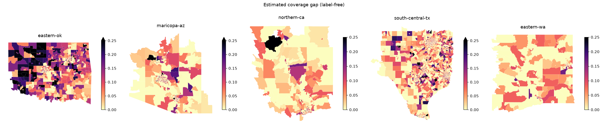

# Best Documentation: A label-free, component-by-component coverage-gap estimator (permitted data only, fully reproducible)

---

**Zindi user:** Teddythebotbuilder · **Submission ID:** Q3WQ174d (`structural_v1`) · **Code:** https://github.com/teddywasserman/overture-coverage-equity
**Overture release:** 2026-08-19.0 (challenge bundle, retrieved 2026-10-02) · **Python 3.13, CPU, about 10 min end to end after the download**

## 0. Summary

Since 2026-09-25 the reference layers (TIGER, Microsoft footprints, HIFLD/USGS, CBP) are withdrawn, and reconstructing the target is prohibited. No labels are published. We therefore do not fit a model to labels. Instead we keep the **official coverage-gap formula's structure** and replace each unobservable reference count with an **estimate built only from Overture's own attributes**.

Every assumption is a named parameter, so each alternative weighting is a single CLI flag. We validate against facts the organisers published, plus a spatial-CV harness that will train on real labels if any are ever released.

**Compliance.** The scored file reads only the Overture extracts, ACS housing, strata tables and tract boundaries. `src/common.py::assert_permitted` refuses any file named like TIGER, Microsoft, HIFLD, USGS structures, CBP or `*-coverage-gap*`, and the download script never fetches them. Because thread 35079 leaves open questions, we have asked the organisers to confirm our use of Overture's road `routes` attribute and place names: {COMPLIANCE_THREAD_URL}.

## 1. What is scored

There are 9,794 census tracts (2020 vintage), as listed in `SampleSubmission.csv`:

| region | eastern-ok | maricopa-az | northern-ca | south-central-tx | eastern-wa |
|---|---|---|---|---|---|
| tracts | 1,192 | 1,593 | 591 | 6,003 | 415 |

`coverage_gap_score` ∈ [0, 1] is the **mean of the defined components**:

| component | official definition | reference (withdrawn) |
|---|---|---|
| transport | 1 − min(1, Overture km in {motorway, trunk, primary, secondary} ÷ TIGER km in {S1100, S1200}) | TIGER/Line |
| building | 1 − min(1, Overture buildings ÷ Microsoft buildings) | MS Building Footprints |
| poi | mean of the facility half, mean over fire / EMS / schools of 1 − min(1, Overture ÷ reference count), and the CBP half, 1 − min(1, all places ÷ CBP establishments) | USGS/HIFLD, CBP |

A component is **undefined** when its reference count is 0. An undefined component drops out of the mean, so the divisor varies by tract.

## 2. The estimator (`src/estimate.py`)

Notation: all lengths are per tract, with roads clipped exactly to the tract polygon in EPSG:5070. All counts are points in polygon.

### 2.1 Transport

TIGER S1100/S1200 is the Interstate, US and State highway system, plus some county highways. Overture records the same network in its `routes` attribute, which comes from OSM route relations. We estimate the unobservable reference length as:

```
TIGER_km_hat = km(route network ∈ {US:I, US:US, US:<state>})      # signed Interstate/US/State
             + γ · km(county-route-numbered roads)                 # γ = 0.5
             + β · km(named-class roads with no route)             # β = 0
transport_gap = 1 − min(1, km(Overture class ∈ {motorway,trunk,primary,secondary}) / TIGER_km_hat)
transport_defined = TIGER_km_hat > 0.1 km
```

**Why γ = 0.5.** TIGER files some county roads as S1200 and others as S1400, and we cannot tell which without TIGER. A half weight is the neutral prior. γ = 0.8 is submitted as an alternative.

**Why β = 0.** An Overture road in a named class but with no route is already counted in the numerator. Adding it to the denominator would only dilute the gap.

### 2.2 Building

Overture's building layer already conflates Microsoft ML footprints. These make up 14% (Maricopa) to 69% (eastern Oklahoma) of Overture buildings, by the `sources` field. The Overture-vs-Microsoft ratio is therefore at or near 1 almost everywhere. We set:

```
building_gap = building_floor = 0
building_defined = (Overture buildings > 0)
```

### 2.3 POI, facility half

For type *k* ∈ {fire, EMS, schools}:

```
ref_k_hat = places in the official Overture category for k
          + places whose NAME says they are k but are filed under another category
            (e.g. "… Volunteer Fire Department" as fire_protection_service,
                  "… Elementary" as community_services)
poi_gap_k = 1 − min(1, in_category_k / ref_k_hat),  defined when ref_k_hat > 0
facility_half = mean of poi_gap_k over the defined k
```

**Rationale.** A misfiled facility demonstrably *exists*, and the official category query misses it. That is exactly the kind of miss the reference count measures.

Across the five regions, name evidence adds 866 fire, 379 EMS and 8,619 school places to the 3,641 / 837 / 24,854 places already in category.

### 2.4 POI, CBP half and composite

```
poi_gap_cbp = cbp_floor = 0,   poi_defined_cbp = True     (assumption: Overture places outnumber CBP establishments in most tracts)
poi_gap     = (facility_half + poi_gap_cbp) / 2  if any facility type defined, else poi_gap_cbp
coverage_gap_score = shrink · mean(defined components),  shrink = 1
```

Every `_gap` and `_defined` column in the submission is written explicitly, in the exact column order of `SampleSubmission.csv`.

### 2.5 Parameters and alternative weightings

| parameter | default | alternative submitted | file | why test it |
|---|---|---|---|---|
| γ (county-route weight) | 0.5 | 0.8 | `v2_gamma08` | the S1200/S1400 split is unknown |
| shrink | 1.0 | 0.5 | `v3_shrink05` | if the metric is MAE, shrinking toward the median (0) helps |
| name evidence | on | off | `v4_no_name_evidence` | isolates the POI signal |
| components | t, p, b | t only | `v5_transport_only` | isolates the transport signal |
| min_km, β, building_floor, cbp_floor | 0.1, 0, 0, 0 | not varied | n/a | fixed by structure; not tuned |

Mean predicted score by file: `structural_v1` 0.0481, `v2` 0.0526, `v3` 0.0240, `v4` 0.0071, `v5` 0.0214.

For `structural_v1`, 44% of tracts score exactly 0, the median is 0.024, and the maximum is 0.49. Regional means are: eastern-ok 0.073, south-central-tx 0.047, maricopa-az 0.041, northern-ca 0.036, eastern-wa 0.029.

## 3. Edge cases

| case | count | handling and result |
|---|---|---|
| zero-population tracts (`pop_total` = 0) | 27 | No special rule. The components follow infrastructure, not people. Mean score 0.014; 48% have a defined transport component. |
| water-dominated tracts (> 50% water by `ALAND`) | 43 | No special rule. Only land features exist in Overture, and the reference estimate is built from the same layer, so there is no artificial gap. Mean score 0.060. |
| tracts with no Overture roads, buildings or places | 2 | All counts are 0, never NaN. Transport, building and facility components are undefined. The POI component is defined only through its CBP half at the 0 floor, so the score is 0. |
| tracts with no named-class road | 137 | Transport is defined only if signed or county routes exist (12% of these). Otherwise it drops out of the mean. |
| tracts where all components would be undefined | 0 | Not possible: the CBP half is always defined. |
| GEOIDs with leading zeros (Arizona `04…`, California `06…`) | all AZ/CA tracts | GEOID is read as text everywhere (`dtype={'GEOID': str}`). |
| NM bootheel tract 35023970000 in maricopa-az | 1 | Kept; membership follows `SampleSubmission.csv`. |
| eastern-wa (added to the sample after launch) | 415 | Same estimator. Submitting without it triggers "Missing entries for IDs …" (thread 35051). |
| lon/lat axis order in DuckDB | n/a | `ST_Transform(geom,'EPSG:4326','EPSG:5070', always_xy := true)`, checked: 0.01° of latitude = 1,110 m. |
| roads crossing tract edges | n/a | Exact `ST_Intersection` length. Segments wholly inside a tract skip the intersection. |
| buildings and places on tract edges | n/a | Assigned by centroid or point, so nothing is double-counted. |
| blank cells / row order | n/a | The writer asserts 9,794 rows, the same order and columns as the sample, no NaN, and booleans written `True`/`False`. |

## 4. Validation (no labels exist)

We cannot measure accuracy against labels honestly, so we provide three weaker checks.

**4.1 Organiser-published facts.** The Info page publishes the share of tracts with ≥ 1 undefined component. In our estimator only transport can be undefined in practice, so we compare our "no estimated highway" share against it:

| region | ours | organiser |
|---|---|---|
| maricopa-az | 64% | 55% ("over half the region has no named-highway road") |
| northern-ca | 32% | 37% |
| south-central-tx | 24% | 28% |
| eastern-ok | 24% | 21% |
| eastern-wa | 25% | not published |

The organiser also states that the ratio between Overture and TIGER named-highway length "ranges from 0.71 to 1.59 across the four study regions". Our estimated TIGER ÷ Overture named km is:

| region | estimated TIGER ÷ Overture named km |
|---|---|
| eastern-ok | 1.31 |
| maricopa-az | 0.50 |
| northern-ca | 0.64 |
| south-central-tx | 0.67 |
| eastern-wa | 0.68 |

The spread is similar: a factor of 2.6 in ours against 2.2 published. The page does not say which direction the published ratio is taken, or which region is which, so this is a plausibility check, not a calibration. We did not tune γ to it.

**4.2 Spatial CV harness** (`src/train.py`). GroupKFold(5) by county (325 groups), seed 42. Models: zero, median, ridge and LightGBM, with hyper-parameters chosen by inner spatial CV. With `--labels` it trains on real labels if they are ever published. On a *proxy* target, our own estimate, it gives:

| model (target = structural estimate) | RMSE | MAE |
|---|---|---|
| zero | 0.0795 | 0.0481 |
| median | 0.0679 | 0.0462 |
| all map features, LightGBM (plumbing check) | 0.0127 | 0.0050 |
| demographics/strata only, LightGBM | 0.0627 | 0.0478 |

The demographics-only model barely beats the median. The gap is a property of the *data sources*, not a function of who lives in a tract.

**4.3 Leaderboard.** We submit `structural_v1` first and then at most a handful of the pre-built variants above, each testing one documented assumption. We do not search parameters against the 30% public split. Public score: {PUBLIC_SCORE}.

## 5. Bias scorecard and equity diagnostics

Scorecard returned with the submission: {SCORECARD_NOTES}.

Our own diagnostics (`src/bias.py`, region fixed effects, county-clustered SEs):

| measure | rural | urban | tribal | non-tribal |
|---|---|---|---|---|
| signed or county-route highway km that Overture files *below* `secondary` | 19.5% | 4.6% | 20.3% | 6.7% |
| buildings whose only source is Microsoft ML | 70% | 31% | 78% | 34% |
| tracts whose only fire station is misfiled | 9.5% | 2.5% | n/a | n/a |

SVI shows no positive association after adjustment. The companion **Best Bias Discovery** post finds a disparity outside the scorecard grid: pediatric dialysis units invisible to category search.

## 6. Limitations

* **No accuracy claim.** Without labels, the estimator's error is unknown. Our public score is the only external check.
* **Shared blind spot.** The transport estimate assumes the OSM route relations in Overture are complete. Where a highway lacks a route relation, both the numerator and the estimate miss it, so the gap is understated.
* **Floors.** Setting building and CBP at 0 discards any real variation in those halves. That is acceptable only if both are small, which we cannot verify without the withdrawn layers.
* **Name evidence** uses regular expressions in English. It misses facilities whose names do not say what they are, and it can include false hits such as a "Fire Station Grill".
* **γ is a prior, not an estimate.** The county share of S1200 varies by state.

## 7. Reproduce

```bash
git clone https://github.com/teddywasserman/overture-coverage-equity && cd overture-coverage-equity
python -m venv .venv && source .venv/Scripts/activate   # or .venv/bin/activate
pip install -r requirements.txt                         # pinned versions
# place Zindi's SampleSubmission.csv at data/SampleSubmission.csv
bash run_all.sh submission   # seconds: uses the committed per-tract features
bash run_all.sh all          # from raw: ~3 GB public download, features, all variants, CV, bias, discovery
```

A clean clone reproduces `outputs/submissions/structural_v1.csv` byte-for-byte.

**Figure attached:** `map_est_gap.png`, the estimated coverage gap by region.




## Public leaderboard result (added 2026-10-02)

Submission `Q3WQ174d` (this estimator, `structural_v1`) scored **0.1028** on the public leaderboard. An all-zero file reportedly scores about 0.06, so on average the label-free estimator over-predicts the coverage gap. We report this as-is and have not tuned against the leaderboard. The documented parameters that would need labels to calibrate are the county-route weight (γ), the unsigned named-class weight (β), and the facility name-evidence rules; the building floor of 0 is an assumption, not a fitted value.
